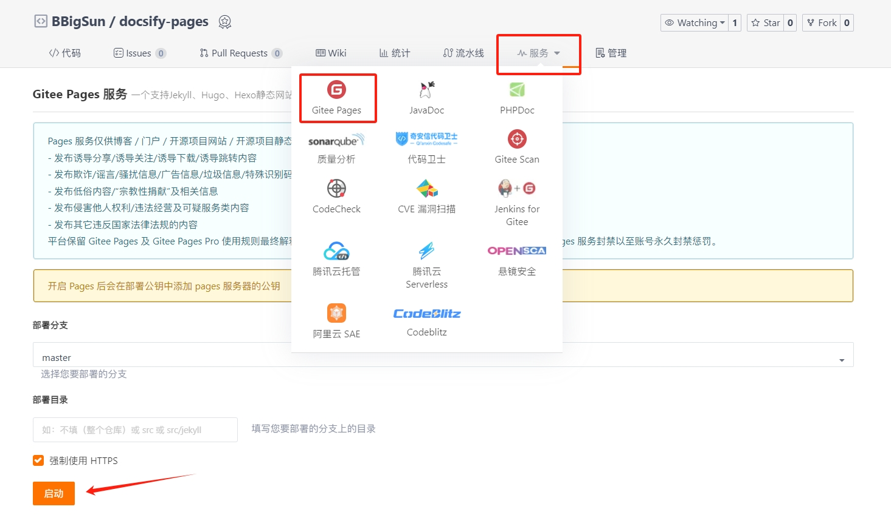

# docsify

> [docsify](https://github.com/docsifyjs/docsify/) 一个神奇的文档网站生成器。
> 以下内容简要介绍如何使用 docsify

使用 docsify + Gitee Pages / GitHub Pages 搭建一个**静态网站**

官方网址：https://docsify.js.org/#/zh-cn/


## 快速开始

如果不关心 docsify 如何安装，可以直接使用以下 4 步：

1、fork 本仓库

- Gitee 仓库地址： https://gitee.com/bbigsun/docsify-pages
- GitHub 仓库地址： https://github.com/bbigsun/docsify-pages

2、修改仓库名称（Gitee/GitHub Settings）

3、更新仓库内容

4、发布到 Gitee pages / GitHub Pages

### 安装 Node.js 

注意：
- (Node.js 版本需不低于 10.13，建议使用 Node.js 12.0 及以上版本)
- 使用 Node.js 官方安装程序时，请确保勾选 Add to PATH 选项（默认已勾选）

下载地址：https://nodejs.org/en/download

具体安装步骤：略


### 安装 Git

下载地址：https://git-scm.com/download/

具体安装步骤：略

### 安装 docsify

```bash
# 设置淘宝源
npm config set registry https://registry.npmmirror.com
# 安装 docsify
npm i docsify-cli -g
```
### 使用 docsify


```bash
docsify init docsify-pages
docsify serve docsify-pages
```

Windows 电脑若是无法执行 docsify 命令，允许脚本执行，存在安全风险
```bash
Set-ExecutionPolicy RemoteSigned -Scope CurrentUser
```

使用完，关闭策略
```bash
Set-ExecutionPolicy Unrestricted -Scope CurrentUser
```
### 提交代码

更新静态网站内容，创建 Gitee 远程仓库并连接，提交代码。

```bash
git config --global user.name "your_name"
git config --global user.email "your_email"

cd docsify-pages
git add .
git commit -m "first commit"
git remote add gitee https://gitee.com/bbigsun/docsify-pages.git
git push -u gitee "master"
```

创建 GitHub 远程仓库并连接，提交代码。

```bash
git remote add github https://github.com/bbigsun/docsify-pages.git
git push -u github "main"
```

### 部署静态网站

#### Gitee Pages



#### GitHub Pages


## docsify 语法

### 配置

#### 默认 `index.html` 

```html
<!DOCTYPE html>
<html lang="en">
<head>
    <meta charset="UTF-8">
    <title>docsify-pages</title>
    <meta http-equiv="X-UA-Compatible" content="IE=edge,chrome=1" />
    <meta name="description" content="Description">
    <meta name="viewport" content="width=device-width, initial-scale=1.0, minimum-scale=1.0">
    <link rel="stylesheet" href="//cdn.jsdelivr.net/npm/docsify@4/lib/themes/vue.css">
</head>
<body>
    <div id="app"></div>
    <script>
        window.$docsify = {
            name: '',
            repo: ''
        }
    </script>
    <!-- Docsify v4 -->
    <script src="//cdn.jsdelivr.net/npm/docsify@4"></script>
</body>
</html>
```

#### 网页标题

```html
<head>
    <title>docsify-pages</title>
</head>
```


#### 网页图标

`_media` 文件夹不能随便改动，默认为它。

```html
<head>
    <link rel="icon" href="/_media/favicon.ico">
</head>
```

#### 文档主题

*官方主题*

```html
<head>
    <link rel="stylesheet" href="//cdn.jsdelivr.net/npm/docsify/themes/buble.css">
    <link rel="stylesheet" href="//cdn.jsdelivr.net/npm/docsify/themes/dark.css">
    <link rel="stylesheet" href="//cdn.jsdelivr.net/npm/docsify/themes/pure.css">
    <link rel="stylesheet" href="//cdn.jsdelivr.net/npm/docsify/themes/dolphin.css">
</head>
```

*其他主题*

```html
<head>
    <link rel="stylesheet" href="//cdn.jsdelivr.net/npm/docsify-darklight-theme@latest/dist/style.min.css">
    <link rel="stylesheet" href="https://cdn.jsdelivr.net/npm/docsify-themeable@0/dist/css/theme-defaults.css">
    <link rel="stylesheet" href="https://cdn.jsdelivr.net/npm/docsify-themeable@0/dist/css/theme-simple.css">
    <link rel="stylesheet" href="https://cdn.jsdelivr.net/npm/docsify-themeable@0/dist/css/theme-simple-dark.css">
</head>
```

#### 主题颜色

`index.html`

```javascript
window.$docsify = {
    themeColor: '#8c3fc8'
}
```

#### 顶部导航栏

`index.html`

```javascript
window.$docsify = {
    loadNavbar: true
}
```

`_navbar.md`

```markdown
<!-- _navbar.md -->

* [🚀 首页](/)
* [✨ Gitee](https://gitee.com/bbigsun/docsify-pages)
* [🐾 docsify](https://docsify.js.org/#/zh-cn/)
* [🎨 留言](https://www.bbigsun.com/message-board)
```

#### 侧边导航栏

`index.html`

```javascript
window.$docsify = {
    loadSidebar: true
}
```

`_sidebar.md`

- 可以引用文件 `[文件](xxx.md)`
- 可以引用链接 `[链接](https://xxxx.com)`
- 可以引用本文 `[本文标题](#标题1)`

```markdown
  * [快速开始](#快速开始)

  * [安装 Node.js](#安装-Node.js)
  * [安装 Git](#安装-Git)
  * [安装 docsify](#安装-docsify)
  * [使用 docsify](#使用-docsify)
  * [提交代码](#提交代码)
  * [部署静态网站](#部署静态网站)

* [配置](#配置)

  * [默认 index.html](#默认-indexhtml)
  * [网页标题](#网页标题)
  * [网页图标](#网页图标)
  * [文档主题](#文档主题)
  * [主题颜色](#主题颜色)
  * [顶部导航栏](#顶部导航栏)
  * [侧边导航栏](#侧边导航栏)
  * [封面](#封面)

* [插件](#插件)
  * [搜索](#搜索)
  * [一键复制](#一键复制)
  * [emoji](#emoji)
  * [代码高亮](#代码高亮)
  * [字数统计](#字数统计)
  * [标签卡](#标签卡)
  * [LaTex 公式](#latex-公式)
  * [高亮引用](#高亮引用)
  * [阅读进度条](#阅读进度条)
  * [Mermaid](#mermaid)
```

#### 封面

`index.html`

```javascript
window.$docsify = {
    coverpage: true
}
```

`_coverpage.md`

```markdown
<!-- _coverpage.md -->

<!--  -->

# docsify-pages <small>latest</small>

> 有些人向来缘浅，有些人向来缘深。

- 有时候，很多事情。
- 第一次，也是最后一次。
- 再见，再也不见；再会，再也不会。

[Gitee](https://gitee.com/bbigsun/docsify-pages.git)
[GitHub](https://github.com/bbigsun/docsify-pages.git)
[Get Started](#快速开始)

<!-- 背景图片 -->

<!--  -->

<!-- 背景色 -->

<!--  -->

```

### 插件

#### 搜索

`index.html`

```html
<body>
    <div id="app"></div>
    <script>
        window.$docsify = {
            name: '',
            repo: '',
            // 全局搜索
            search: {
                paths: 'auto',
                placeholder: '请输入搜索词：www',
                noData: '找不到结果',
                depth: 3
            }
        }
    </script>
    <!-- 搜索插件 -->
    <script src="//cdn.jsdelivr.net/npm/docsify/lib/plugins/search.min.js"></script>
<body>
```

#### 一键复制

`index.html`

```html
<body>
    <div id="app"></div>
    <script>
        window.$docsify = {
            name: '',
            repo: '',
            // 一键复制
            copyCode: {
                buttonText : '复制',
                errorText  : 'Error',
                successText: 'Success'
            }
        }
    </script>
    <!-- 一键复制插件 -->
    <script src="//cdn.jsdelivr.net/npm/docsify-copy-code"></script>
<body>
```

#### emoji

`index.html`

```html
<body>
    <!-- emoji插件 -->
    <script src="//cdn.jsdelivr.net/npm/docsify/lib/plugins/emoji.min.js"></script>
</body>
```

#### 代码高亮

`index.html`

```html
<body>
    <!-- 代码高亮 -->
    <script src="//cdn.jsdelivr.net/npm/prismjs@1/components/prism-c.min.js"></script>
</body>
```

#### 字数统计

`index.html`

```html
<body>
    <div id="app"></div>
    <script>
        window.$docsify = {
            name: '',
            repo: '',
            // 字数统计
            count:{
                countable: true,
                position: 'top',
                margin: '10px',
                float: 'right',
                fontsize:'.9em',
                color:'rgb(90,90,90)',
                language:'chinese',
                localization: {
                words: "",
                minute: ""
                },
                isExpected: true
            }
        }
    </script>
    <!-- 字数统计 -->
    <script src="//unpkg.com/docsify-count/dist/countable.js"></script>
<body>
```

#### 标签卡

`index.html`

```html
<body>
    <div id="app"></div>
    <script>
        window.$docsify = {
            name: '',
            repo: '',
            // 标签卡
            tabs: {
                persist    : true,      // default
                sync       : true,      // default
                theme      : 'classic', // default
                tabComments: true,      // default
                tabHeadings: true       // default
            }
        }
    </script>
    <!-- 标签卡插件 -->
    <script src="https://cdn.jsdelivr.net/npm/docsify-tabs@1"></script>
<body>
```

*使用语法*

```markdown
<!-- tabs:start -->

#### **English**

Hello!

#### **French**

Bonjour!

#### **Italian**

Ciao!

<!-- tabs:end -->
```

展示效果：

<!-- tabs:start -->

#### **English**

Hello!

#### **French**

Bonjour!

#### **Italian**

Ciao!

<!-- tabs:end -->


#### LaTex 公式

`index.html`

```html
<head>
    <link rel="stylesheet" href="//cdn.jsdelivr.net/npm/katex@latest/dist/katex.min.css"/>
</head>
<body>
    <!-- LaTeX插件 -->
    <script src="//cdn.jsdelivr.net/npm/docsify-katex@latest/dist/docsify-katex.js"></script>
</body>
```

#### 高亮引用

```html
<body>
    <!-- 高亮引用插件 -->
    <script src="https://unpkg.com/docsify-plugin-flexible-alerts"></script>
</body>
```

#### 阅读进度条

`index.html`

```html
<body>
    <div id="app"></div>
    <script>
        window.$docsify = {
            name: '',
            repo: '',
            // 阅读进度条
            progress: {
                position: "top",//默认上方
                color: "var(--theme-color,#42b983)",//进度条颜色
                height: "3px",//进度条高度
            }
        }
    </script>
    <!-- 阅读进度条插件 -->
    <script src="https://cdn.jsdelivr.net/npm/docsify-progress@latest/dist/progress.min.js"></script>
<body>
```

#### Mermaid

`index.html`

```html
<body>
    <!-- mermaid插件 -->
    <script src="//unpkg.com/mermaid/dist/mermaid.js"></script>
    <script src="//unpkg.com/docsify-mermaid@latest/dist/docsify-mermaid.js"></script>
    <script>mermaid.initialize({ startOnLoad: true });</script>
</body>
```
